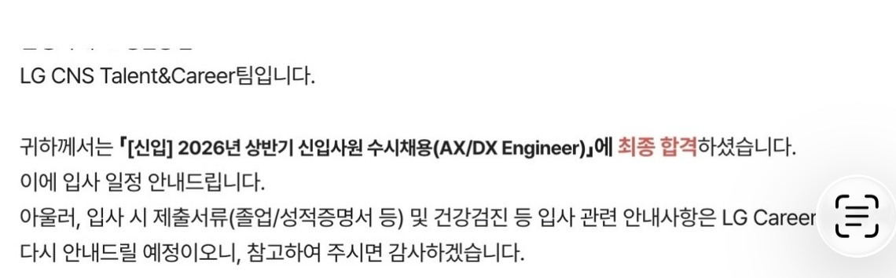

> 40개 기업에 지원한 개발자의 LG CNS 금융 AX/DX 엔지니어 면접 후기

> ##### 26 상반기 면접 후기
> - [LG CNS 금융 AX/DX 엔지니어 면접 후기 (최종 합격)](https://inyoung.dev/lg-cns-ax-dx-engineer-final-pass-review/)
> - [하나은행 AI/ICT 인턴 면접 후기 (최종 합격)](https://inyoung.dev/hana-bank-ai-ict-intern-final-pass-review/)
> - [현대자동차 모빌리티 서비스 개발 면접 후기 (최종 탈락)](https://inyoung.dev/hyundai-motor-mobility-service-development-interview-review/)
> - [현대모비스 CI/CD/CT 면접 후기](https://inyoung.dev/hyundai-mobis-cicdct-interview-review/)
> - [새마을금고중앙회 IT 면접 후기](https://inyoung.dev/saemaeulgeumgo-central-it-interview-review/)

#### 스펙

- 서성한 비전공자 & 소프트웨어 전공
- 학점: 4.07 / 4.5 (전공 4.18 / 4.5)
- 인턴: 핀테크 기업 어시스턴트 6개월, 스타트업 프론트엔드 개발 인턴 6개월
- 자격증: AWS Solutions Architect Associate, 정보처리기사, SQLD, 네트워크관리사 2급
- 어학: 오픽 IH, 토익 900+
- 수상: 교내 해커톤 대상, 정부기관 주최 해커톤 우수상

## 1️⃣ 지원 과정

#### 서류

이력서, 포트폴리오 pdf를 첨부하는 란이 따로 있었다.

#### 인적성

CNS는 코딩테스트 전형이 따로 없었고, 대신 인적성 검사를 실시했다. 청년취업 서울고용센터에서 주최한 채용설명회에서 CNS HR 담당자분이 말씀하시길, 앞으로는 코테 전형 없이 인적성 검사 난이도를 올릴 거라고 하셨다. 하반기 공채 준비하시는 분들은 참고하면 좋을 거 같다.

> 청년취업 서울고용센터에서 다양한 기업의 채용 설명회가 열리니 참고하시길 (https://open.kakao.com/o/goxRZ6hi)

## 2️⃣ 1차 면접 (1:2, 40분)

두 명이 함께 들어가는 방식이었는데, 비슷한 배경의 지원자끼리 묶어서 면접을 보는 거 같았다. 

받은 질문은 아래와 같다.

- (공통) 자기소개
- 인턴 경험 관련 질문
- 맡은 개발 도메인 설명 요구
  - (백엔드를 FastAPI로 구현했다고 답하자) Java/C 경험이 있는지
- 자소서 프로젝트에 쓰인 라이트한 Spring 질문 (DI, MVC)
- 상황 가정 질문: "프로젝트에 투입되면 초반에는 특정 업무 영역의 개발자로 들어가게 됩니다. 어느 정도 개발 물량을 맡아 진행하고 있는데, PM이 옆 개발자와 함께 다른 건에 착수하라고 해서 업무량이 더 늘었어요. 어떻게 하시겠습니까?"
- 해커톤에서 팀장을 맡았는데, 프로젝트를 리딩하며 어려웠던 점과 해결 경험
- 성격의 장단점
- 연애 상담 서비스를 운영했다고 하는데, 이력만 봐도 자유로운 영혼일 거 같습니다. 여기서 코볼이나 C를 개발하면 답답하지 않을까요?
- 서비스 개발 인턴을 꽤 오래 했는데 채용연계형이 아니었는지, 왜 LG CNS로 취업 준비를 하게 되었는지
- 트랜잭션 설계 경험이 있는지
- 본사가 아니라 프로젝트에 따라 경기·지방·해외 근무가 될 수도 있는데 어떻게 생각하는지

다른 후기를 찾아봤을 때는 딥한 기술 질문보다 인성 위주 검증이 대부분이라는 얘기가 많았는데, 나 같은 경우는 반반 정도였다.

## 3️⃣ 최종 면접 (1:1, 20분)

임원분과 1:1로 진행됐고, 편안한 분위기 속에서 진행됐다.

받은 질문은 아래와 같다.

- 자기소개
- 왜 금융쪽인지
- 왜 토스/카뱅이 아니라 CNS인지
- 앞으로의 LG CNS에서의 커리어 설계 (1년 후, 5년 후, 10년 후)
  - 왜 개발이 아니라 금융 도메인 전문가가 되고 싶은지
- 인턴 경력 관련 질문
- 채용 관련 궁금한 내용
- 마지막 할 말

누구나 예상할 수 있는 질문 범위 내에서 오갔다. 최종까지 포함한 전형이 전부 비대면으로 이루어졌고, 진행 속도가 굉장히 빨랐다.

## 4️⃣ 느낀 점

연애 상담 서비스를 운영했던 이력에 대해서, "이력만 봐도 자유로운 영혼일 거 같은데 여기서 코볼이나 C를 개발하면 답답하지 않겠냐"는 질문을 받았다. 솔직히 이런 방향의 질문은 전혀 예상하지 못했다. 기술 스택보다 오히려 "이 사람이 SI 조직에 잘 정착할 수 있을까"를 확인하려는 질문이라는 인상을 받았다.

근무지 관련 질문도 비슷한 결이었다. 본사가 아니라 프로젝트에 따라 경기, 지방, 해외 근무가 될 수도 있다는 걸 어떻게 생각하냐는 질문이 1차와 최종 양쪽에서 다 나왔다. SI라는 업 특성상 반복해서 확인하는 질문인 거 같았다.

최종 면접은 1차와 분위기가 확연히 달랐다. 임원분과 1:1로 20분 정도, 편안하게 진행됐다. 나는 금융 도메인의 전문가가 되고 싶다라는 컨셉을 잡아 면접에 임했는데 (실제 목표이기도 함) 이 컨셉이 잘 통한 거 같았다. 왜 개발이 아니라 금융 도메인 전문가가 되고 싶은지에 대해 임원분과 얘기를 가장 오래 나눴다.

전형 전체를 돌아보면, 1차는 기술적인 허들, 조직 적합성을 확인하는 자리였고 최종은 방향성과 동기를 확인하는 자리였다는 느낌이 들었다. 다른 후기를 통해서 듣던 것과는 다르게 기술 검증에 쏟았던 준비가 무의미하지는 않았다.

## 결과

현재는 최종 합격하고 약 2주정도 진행되는 신입 교육을 듣는 중이다! 교육에 입과하면서 놀랐던 건, 내가 생각한 것보다 **훨씬 더 많은 인원** 이 뽑혔다는 것이었다.
최근 들어 LG CNS에서 여러 대규모 금융 사업(NH농협은행, 새마을금고) 수주를 하면서, 이런 배경이 있지 않았나 싶다.

과연 어떤 프로젝트에 투입될지... 동기들 사이에서 말이 많은데 뭐가 됐든 미래에 성장할 수 있는 곳에 배치되었으면 좋겠다~
