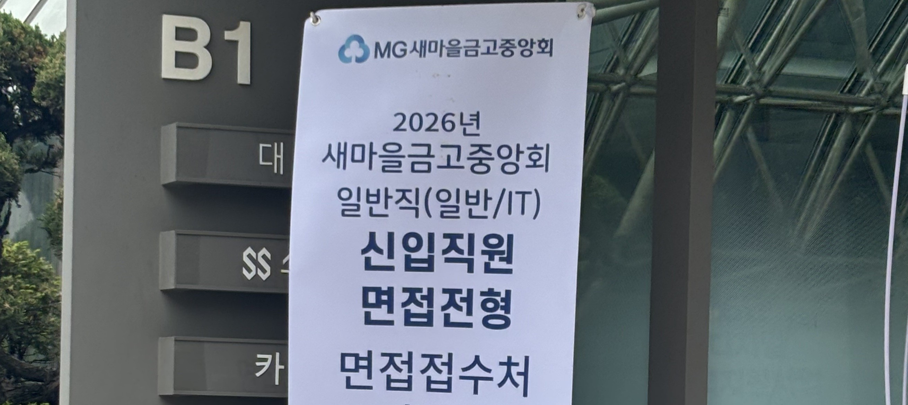

> 40개 기업에 지원한 개발자의 새마을금고중앙회 IT 면접 후기

> ##### 26 상반기 면접 후기
> - [LG CNS 금융 AX/DX 엔지니어 면접 후기 (최종 합격)](https://inyoung.dev/lg-cns-ax-dx-engineer-final-pass-review/)
> - [하나은행 AI/ICT 인턴 면접 후기 (최종 합격)](https://inyoung.dev/hana-bank-ai-ict-intern-final-pass-review/)
> - [현대자동차 모빌리티 서비스 개발 면접 후기 (최종 탈락)](https://inyoung.dev/hyundai-motor-mobility-service-development-interview-review/)
> - [현대모비스 CI/CD/CT 면접 후기](https://inyoung.dev/hyundai-mobis-cicdct-interview-review/)
> - [새마을금고중앙회 IT 면접 후기 ](https://inyoung.dev/saemaeulgeumgo-central-it-interview-review/)

#### 스펙

- 서성한 비전공자 & 소프트웨어 전공
- 학점: 4.07 / 4.5 (전공 4.18 / 4.5)
- 인턴: 핀테크 기업 어시스턴트 6개월, 스타트업 프론트엔드 개발 인턴 6개월
- 자격증: AWS Solutions Architect Associate, 정보처리기사, SQLD, 네트워크관리사 2급
- 어학: 오픽 IH, 토익 900+
- 수상: 교내 해커톤 대상, 정부기관 주최 해커톤 우수상

## 1️⃣ 지원 과정

#### 코딩테스트 및 NCS

코딩테스트는 5문제로, 구현 성격의 문제 4개와 `Union-Find`(`DFS`, `BFS` 활용) 문제 1개가 출제됐다. 5문제 중 4문제를 풀었다.

`NCS`는 전날 급하게 세트 1개 정도만 풀고 응시했다. IT 직군은 `NCS`보다 코딩테스트 점수의 비중이 더 큰 거 같다.

## 2️⃣ 1차 면접 구성

삼성역 인근 대관 공간에서 반나절 동안 대면으로 진행됐다. 복장은 풀정장으로 통일됐다.

진행 순서는 다음과 같이 진행됐다.

- 인성검사
- 토론 면접
- 실무진 면접
- 코딩테스트 기반 PT 면접

실무진 면접과 PT 면접은 두 그룹으로 나뉘어, 오전 실무진/오후 PT, 오전 PT/오후 실무진 순서로 큰 컨베이어 벨트처럼 진행됐다.

#### 인성검사

컴퓨터용 사인펜으로 직접 마킹하는 방식이었다. 수정테이프 사용이 불가능해 신중하게 마킹해야 했고, 문제지를 중간에 교체할 경우 시간 제한에 걸릴 위험이 있었다.
나는 다행히 초반에 문제지를 교체하여, 아슬아슬하게 검사를 마칠 수 있었다.

#### 토론 면접

IT 직군과 금융 일반 직군이 섞인 팀으로 진행됐다. 주제는 고령 운전자 면허 반납에 관한 것이었는데, 조별로 자유롭게 진행자를 선정해 찬반으로 나누어 토론했고, 평가자들도 자리에 함께 앉아 관찰했다. 

진행자를 자원받고 진행 형식 역시 자유롭기 때문에, 미리 진행을 어떻게 할 지 고민을 하고 진행자 역할을 자원하는 것도 방법일 거 같다.

#### 실무진 면접

찾아본 후기와 달리, 새마을금고중앙회에 대한 지원 동기나 로열티 관련 질문보다는, `CS` 지식, 특히 **데이터베이스** 관련 질문이 위주였다.

## 3️⃣ 실무진 면접 질문

기억나는 것은 아래와 같다.

자소서에 기술 블로그에 공부한 내용을 정리한다고 작성했는데,실무진 면접에서 "그러면 당연히 전공 지식을 남들보다 더 잘 알고 있겠네요?" 라는 질문으로 빌드업을 하셨다.

- `TCP`와 `UDP`의 차이, 각각의 활용 예시
- `HTTP`와 `HTTPS`의 차이
- `TLS`에 대한 설명 요구
-  DFS BFS 설명해봐라
- 라이브러리와 프레임워크의 차이 (제어의 주도권 여부로 답하자, "그런 것 말고 핵심적인 차이가 뭐냐"는 재질문)
- 라이브러리와 프레임워크의 예시를 들어라
- 데이터베이스 인덱스가 어떤 자료구조로 구현되어 있는지
- 해당 자료구조의 시간복잡도
- 해시맵은 시간복잡도가 O(1)인데 인덱스에 왜 쓰이지 않는지
- `B-Tree`와 `B+Tree`의 차이
- 데이터베이스에 10억 건의 데이터가 적재되어 있다고 가정할 때, 효율적으로 정보를 탐색하는 방법 (이 주제로 가장 오래 대화를 주고받았다..)
- 학부연구생을 왜 했는지
- 인턴 경험 관련 질문 (채용연계형이 아니었는지)

다른 인성적인 질문도 몇 개 받았던 거 같다.
전체적으로 엄중하고 삭막한 분위기 속에서 진행이 되었다. 

## 4️⃣ 면접에서 유의할 점

#### 은행 IT 라는 점을 기억하자

라이브러리와 프레임워크의 예시를 묻는 질문이 있었는데,

프론트엔드에 익숙한 나는 리액트를 라이브러리, Next.js를 프레임워크라고 답했다.
그러자 "진짜 리액트가 라이브러리라고 생각하세요?"라는 재질문이 들어왔고 그렇다고 답하자 질문을 한 면접관분께서 고개를 절레절레 흔드셨다.

아마 면접관 분은 리액트를 대표적인 프레임워크로 생각하신 거 같았다. (...) 면접관의 맥락을 파악하고, 금융권에서 주로 쓰는 스택을 기준으로 답변하는 게 좋을 거 같다.

금융 IT 면접에서 `Kafka`, `MSA`, `Kubernetes` 같은 최신 기술 스택 이야기를 꺼내는 거에 대한 의문이 들었다. 오히려 개발자의 기본 이해도, 특히 데이터베이스 쪽의 단단함을 보여주는 게 좋을 거 같다는 생각이 드는 면접이었다.

#### 코테 PT 면접 범위

사전 공지로는 준비한 5문제 전부를 발표하는 것으로 안내됐지만, 실제 현장에서는 시간상 1문제만 발표하는 것으로 변경됐다. 이전 실무진 면접관들이 그대로 참석한 상태로 진행됐고, 코딩테스트 난이도 자체가 어렵지 않았던 만큼 발표 내용보다는 왜 5문제를 모두 풀지 못했는지에 대한 질문이 이어졌다. 

#### 컨베이어 벨트식 면접 진행

면접관 3명이 배석했는데, 다수 지원자를 연속으로 상대하는 구조여서인지 답변 중 시선을 거의 마주치지 않았다. 이런 진행 분위기를 미리 감안하고 들어가길...

## 결과

불합격했다 ㅎㅎ
데이터베이스 전공 지식을 정말 많이 물어보니 참고하시길~!
