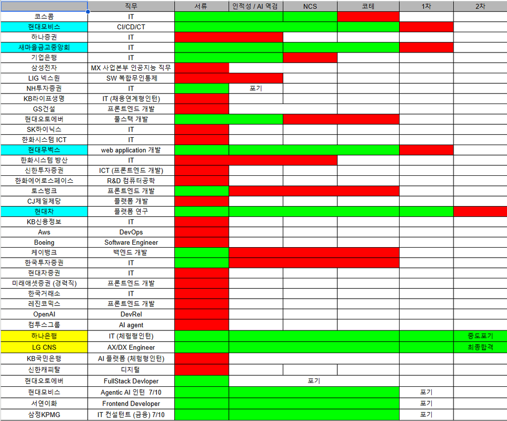
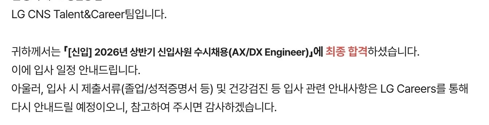

> `프론트엔드 개발자`를 목표로 준비하다가, 졸업학기인 26년 상반기에 **40개** 기업에 지원하며 `금융 IT`로 방향을 급하게 (강제로) 전환했습니다.
> 그 과정에서의 전략과 지원 결과, 그리고 돌아봤을 때 실제로 도움이 됐던 것과 아니었던 것을 정리해봤습니다.

각 기업의 구체적인 면접 후기는 별도 글로 이어서 다루겠습니다!

- [LG CNS 금융 AX/DX 엔지니어 면접 후기 (최종 합격)]()
- [하나은행 AI/ICT 인턴 면접 후기 (최종 합격)]()
- [현대자동차 모빌리티 서비스 개발 면접 후기 (최종 탈락)]()
- [현대모비스 CI/CD/CT 면접 후기 (1차 탈락)]()
- [새마을금고중앙회 IT 면접 후기 (1차 탈락)]()
- [현대무벡스 웹개발 면접 후기 (1차 탈락)]()

## 1️⃣ 기본 정보

#### 스펙

- 서성한 비전공자 & 소프트웨어 전공
- 학점: 4.07 / 4.5 (전공 4.18 / 4.5)
- 인턴: 핀테크 기업 어시스턴트 6개월, 스타트업 프론트엔드 개발 인턴 6개월
- 자격증: AWS Solutions Architect Associate, 정보처리기사, SQLD, 네트워크관리사 2급
- 어학: 오픽 IH, 토익 900+
- 수상: 교내 해커톤 대상, 정부기관 주최 해커톤 우수상

#### 지원 전략: 40개 난사

졸업학기 15학점과 학부연구생을 병행하면서 프론트엔드, 백엔드, DevOps, 경력직, 외국계를 가리지 않고 `40여 개` 기업에 지원했다.
나는 한 곳에 오래 공을 들이기보다, 마감 되기 일주일 전 경험 정리한 것을 기반으로 ai를 활용해 지원서를 빠르게 완성하고, 하루 전에 다시 검토하곤 했다.

> **💡 왜 난사 전략을 택했는가?**
>
> 첫 시즌에 바로 원하는 결과를 얻기는 어렵다고 판단했다.
> 서류나 코딩테스트 단계에서 걸러지는 경우가 많았기 때문에, 지원 수를 줄였다면 애초에 면접 경험 자체를 해볼 기회가 매우 적었을 것이다.
> 최대한 많은 면접을 통해 다양한 도메인을 경험해보는 것을 목표로 삼았다.

#### 취준을 게임처럼..

나는 친구들한테도 서스럼없이 탈락 결과와 합격 결과를 공유하면서, 취업 준비를 마냥 무겁게 하기보다 가볍게 게임처럼 즐기면서 진행했다.

심한 경쟁 상황에서, 지원 하나하나에 의미를 부여하기 시작하면 탈락 메일이 올 때마다 타격이 클 거라고 생각했다.
대신 지원을 하나의 스테이지 클리어로 여기고, 탈락하면 "딴 데 가면 되지 뭐~" 했던 거 같다. (일종의 정신승리)
그래도 멘탈 관리 측면에서 이 접근이 실질적으로 도움이 된 거 같다.

## 2️⃣ 지원 결과와 느낀 점

#### 결과 요약

| 구분           | 기업                                                   |
| -------------- | ------------------------------------------------------ |
| 서류 합격      | 17/40                                                  |
| 코테/과제 탈락 | 코스콤, 현대오토에버, 토스뱅크, 케이뱅크, 한국투자증권 |
| 전형 포기      | NH투자증권, 삼정KPMG, 서연이화                         |
| 1차 탈락       | 새마을금고중앙회, 현대무벡스, 현대모비스               |
| 최종 탈락      | 현대자동차                                             |
| **최종 합격**  | **LG CNS, 하나은행 (인턴)**                            |

#### 서비스 프론트엔드 채용의 증발

2-3년간 프로젝트, 인턴, 수상 경험을 쌓으며 서비스 기업 프론트엔드 개발자를 목표로 했지만, 26년 상반기에 서비스/스타트업 **프론트엔드 신입 채용 자체가 거의 사라졌다.**
40개 포지션 중 자사 서비스 프론트엔드로 분류할 수 있던 곳은 3곳(토스뱅크, 레진코믹스, GS건설)뿐이었고, 그마저도 한 자릿수 채용에 수천 명이 몰렸다.

이 판단에 따라 대기업과 금융권까지 지원 도메인을 넓혔다.

#### 포지셔닝 전환: 프론트엔드 to 금융 IT

교내 AI 학회 경험을 기반으로 AI 직무에도 지원했고, 핀테크 대기업 인턴 경험을 살려 금융 IT에도 지원했다. 또한 Spring 학습을 상반기부터 병행하며 백엔드 직무도 함께 지원 범위에 넣었다.

면접에서 반복적으로 확인한 것은, 프론트엔드 중심의 역량 기반 답변이 일반적인 대기업·금융 IT 면접에서는 면접관의 공감대를 얻기 어렵다는 점이었다. 대기업/금융권 면접 5곳에서 탈락한 뒤, 포커스를 프론트엔드 역량이 아닌 핀테크 인턴 경험 기반의 금융 IT 도메인 지식으로 옮겼다.

결과적으로 **LG CNS 금융 AX/DX 엔지니어, 하나은행 인턴 직무**에서 최종 합격했다. 금융 IT 컨설턴트나 IT 기획 직무에도 무지성으로 지원했는데 면접 기회로 이어진 것을 보면, 지원 카드를 도메인별로 다양하게 가져가는 전략이 유효했다고 판단한다.

## 3️⃣ 취업에 실질적인 도움이 된 활동

아래는 주관적인 판단이므로 참고용으로만 봐주기 바란다.

#### 멋쟁이사자처럼 (IT 동아리)

서비스 개발 입문 단계에서 기초부터 차근차근 쌓아 프로젝트를 진행하기 좋았다. 에이전트로 누구나 결과물을 만들 수 있는 환경이지만, 서비스 개발의 시작은 기초를 탄탄히 쌓는 데 있다고 생각한다. 전국 연합 해커톤, 신촌톤, 아이디어톤 등에서 다른 학교 멋사와 교류하며 네트워킹도 할 수 있었다.

#### CES 2025 파견

학교 LINC 사업단 주최로 CES 2025 라스베이거스 파견(항공비, 숙박비, 활동비 지원)에 참여했다. CES에는 삼성, 모비스, LG, SK 등 대기업도 참가하기 때문에 지원 동기를 쓰는 데도 도움이 됐고, 해외 영업 경험을 통해 어학 역량도 함께 어필할 수 있었다.

#### AWS Solutions Architect Associate 자격증

`AWS` 클라우드 생태계에 대한 지식을 습득할 수 있고, 정보처리기사·SQLD 에 비해 희소성이 있는 자격증이다. 다만 준비에 최소 1-2주 몰입이 필요하고 응시비가 24만원이다. (...)

#### 취준메이트 스터디

겨울방학부터 멋사 내에서 취준메이트를 구해 주 2회 CS 면접, 코딩테스트 스터디를 진행했다. 취업 준비는 장기전이므로, 열정적인 사람들과 규칙과 루틴을 함께 만드는 것을 추천한다.

#### 경험 정리와 AI 활용

취업 시즌 전, 겨울방학 동안 노션에 모든 경험을 정리했다. 이를 CSV로 추출해 `ChatGPT`, `Claude`에 맥락으로 주입함으로써 자기소개서 작성 속도를 크게 높일 수 있었다. 경험 정리는 실제 자기소개서 프로젝트란에 들어갈 내용이라고 가정하고 개조식으로 작성했다.

#### 기술 블로그 작성

학부 때부터 전공 지식을 기술 블로그에 작성하는 습관을 들이면 머릿속 내용이 정리되는 효과가 있었다. 남에게 쉬운 언어로 설명할 수 있는 형태로 글을 가공하는 과정에서 개념이 자연스럽게 체화됐다.

#### 완성도 있는 포트폴리오

LG, CJ, 토스, 현대자동차, 컴투스그룹 등에서 포트폴리오 첨부란이 별도로 있었다.
포트폴리오, 이력서를 완성할 떄는 현직자 피드백을 기반으로 고쳐나가는 과정이 반드시 필요하다고 생각한다. 또한 디자인 단계에서는 `Claude Design`이나 `Figma Make` 같은 도구를 활용하면 디자인을 못해도 완성도를 꽤 높일 수 있다. 다만 AI 티가 나기 떄문에, 기업 로고나 CI 컬러를 활용하여 최소한의 성의를 표현하는 것도 방법인 거 같다.

#### 네카당토 계열사 체험형 인턴

일부 서비스 기업 계열사는 자체 채용 플랫폼에서 체험형 인턴 성격의 어시스턴트를 수시·상시 채용한다. 일반 채용 플랫폼에 노출되지 않는 경우가 많아 경쟁률이 상대적으로 낮으므로, 이름값 있는 서비스 기업을 노릴 때 전략적으로 고려할 만하다.

#### 학교 코딩 과목 조교

파이썬, C 같은 기초 과목의 감을 유지하면서 대외활동 이력에 한 줄을 추가할 수 있었다. 출석 체크, 채점, 질문 응대 위주의 업무라 다른 근로에 비해 시간 대비 부담이 적었다.

#### 막학기 운동 교양

운동 교양 수강을 통해 강제로라도 규칙적인 운동을 할 수 있었다. 취업 준비로 지칠 때 학교에서 운동하고 씻고 나면 리셋되는 감각이 도움이 됐다.

## 4️⃣ 취업에 큰 도움이 되지 않았던 활동

이 항목 역시 주관적인 판단이므로 참고만 하기 바란다.

#### 자격증 여러 개 취득

정보처리기사와 SQLD는 전공 지식을 복습하는 데는 도움이 됐지만, 실제로는 자격증란에 AWS 자격증 하나만 기재한 경우도 있었다. 다시 돌아간다면, 여러 자격증을 취득하기보다 정처기 정도 딴다음에 차별점을 만들 수 있는 희소성 있는 자격증(`CCNA`, `AWS`)을 땄을 거 같다.

#### 도피성 부트캠프

가능하다면 부트캠프보다 현장실습이나 스타트업 인턴 경험을 쌓는 편이 낫다고 생각한다. 기술 HR 담당자와 실무 개발자들사이에 부트캠프 출신에 대한 암묵적인 프레임이 존재한다고 생각한다.

#### 컴퓨터공학이 아닌 융합소프트웨어 전공 선택

전공 지식 학습 측면에서 융합소프트웨어가 컴퓨터공학보다 학점 취득이 상대적으로 수월해, 시험 대비를 덜 하게 되는 경향이 있었다.
40개 서류 지원 결과를 기준으로 봤을 때도, 전통적인 대기업 IT에서는 컴퓨터공학 전공, 특히 본전공 학생을 확실히 선호하는 경향이 있는 거 같다.

## 5️⃣ 그래서 결과는..?

40개 기업에 지원하며 겪은 개발자 취업 시장은 **예상보다 훨씬 쉽지 않았다**.
특히 면접에서 5번 연속 탈락할 때, 내가 '개발자'가 정말 맞는지, 내가 원하는 기업과 직무가 맞는지, 내가 준비한 것이 맞는지에 대한 회의감이 들었던 거 같다.

돌이켜봤을 떄 물론 내가 부족했던 것도 맞지만, **개발자 채용 규모 자체가 점점 줄어들고 있는 상황적인 부문**이 크게 작용했다고 생각한다. 자연스럽게 지원자 풀이 고이게 되고, 심지어 2-3년차 대기업 SI 개발자분과 함께 신입 면접을 본 적도 있었다...

결과적으로 이런 시장 상황에서, 졸업과 동시에 금융 IT로 방향을 전환하며 최종 합격한 것은 다행인 거 같다!

### 26-상반기 면접 상세 후기는 이곳에서!!

> - [LG CNS 금융 AX/DX 엔지니어 면접 후기 (최종 합격)]()
> - [하나은행 AI/ICT 인턴 면접 후기 (최종 합격)]()
> - [현대자동차 모빌리티 서비스 개발 면접 후기 (최종 탈락)]()
> - [현대모비스 CI/CD/CT 면접 후기 (1차 탈락)]()
> - [새마을금고중앙회 IT 면접 후기 (1차 탈락)]()
> - [현대무벡스 웹개발 면접 후기 (1차 탈락)]()
