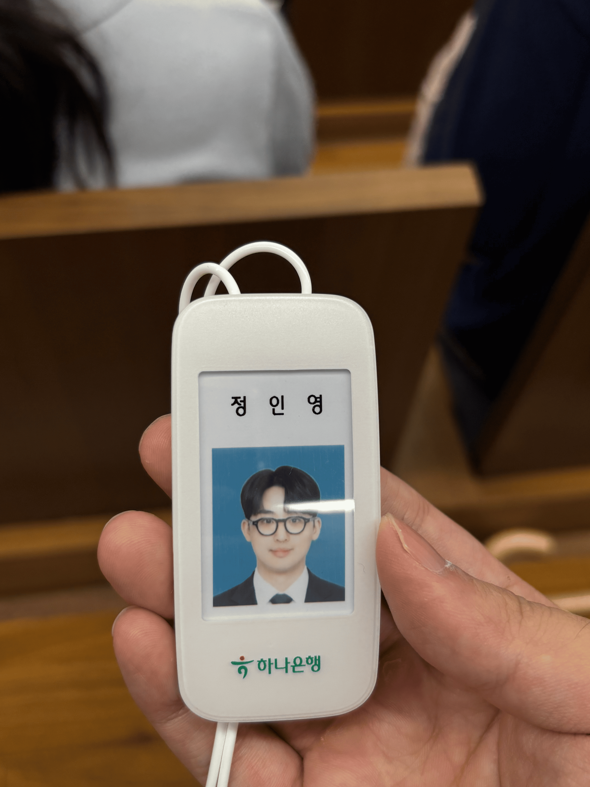

> 40개 기업에 지원한 개발자의 하나은행 AI/ICT 인턴 면접 후기

> ##### 26 상반기 면접 후기
> - [LG CNS 금융 AX/DX 엔지니어 면접 후기 (최종 합격)](https://inyoung.dev/lg-cns-ax-dx-engineer-final-pass-review/)
> - [하나은행 AI/ICT 인턴 면접 후기 (최종 합격)](https://inyoung.dev/hana-bank-ai-ict-intern-final-pass-review/)
> - [현대자동차 모빌리티 서비스 개발 면접 후기 (최종 탈락)](https://inyoung.dev/hyundai-motor-mobility-service-development-interview-review/)
> - [현대모비스 CI/CD/CT 면접 후기](https://inyoung.dev/hyundai-mobis-cicdct-interview-review/)
> - [새마을금고중앙회 IT 면접 후기](https://inyoung.dev/saemaeulgeumgo-central-it-interview-review/)

#### 스펙

- 서성한 비전공자 & 소프트웨어 전공
- 학점: 4.07 / 4.5 (전공 4.18 / 4.5)
- 인턴: 핀테크 기업 어시스턴트 6개월, 스타트업 프론트엔드 개발 인턴 6개월
- 자격증: AWS Solutions Architect Associate, 정보처리기사, SQLD, 네트워크관리사 2급
- 어학: 오픽 IH, 토익 900+
- 수상: 교내 해커톤 대상, 정부기관 주최 해커톤 우수상

## 1️⃣ 지원 과정

#### 서류

하나은행은 특이하게도, IT 직군으로 입사해도 창구 업무를 2년간 거쳐야 한다. 그래서인지 서류 단계부터 개발 역량 못지않게 고객 대응 경험을 중요하게 보는 것 같았다. 면접에서도 IT 직군인데 알바 경험이나 대면 서비스 경험을 자소서에 녹인 지원자들이 유독 많이 보였다.

나는 CES에서 했던 해외 영업 경험을 자소서에 풀어냈다. 나중에 같이 합격한 사람들 얘기를 들어보니, 다들 개발 프로젝트보다 고객 대응 관련 알바 경험을 앞세워 썼다고 했다. 개발 역량만 강조했다면 오히려 서류에서 걸러졌을 수도 있겠다는 생각이 들었다.

#### 코딩테스트

알고리즘 3문제, SQL 2문제 구성이었다. 알고리즘은 구현 문제 2개는 무난했는데, 마지막 문제가 DP로 원의 포함관계를 판별하는 문제였다. 시험 보는 중에 DP로 접근해야 한다는 감이 안 와서 백트래킹으로 완전탐색을 돌렸는데, 아마 이 부분에서 시간초과가 났을 것 같다. SQL 2문제는 크게 어렵지 않았다.

체감상 4.5솔 정도가 커트라인이었던 것 같다. 

## 2️⃣ 면접 구성

면접은 하나은행 청라연수원에서 대면으로 진행됐다. 하루 종일 붙잡혀 있는 일정이라 각오하고 갔는데, 자소서 기반 BEI 면접과 PT 면접 두 개를 하루에 다 치르는 구조였고, `BEI 1시간`, `PT 20분` 정도로 진행됐다. 모든 그룹의 면접이 끝날 때 까지 청라연수원 내의 삐까뻔쩍한 휴게, 편의 시설을 이용하며 기다릴 수 있었다. 운이 좋게도 나는 첫번째 그룹이어서, 거의 1시간 반 안에 면접 전형이 끝나 게임장 같은 곳에서 면접 조원들과 시간을 보내고 휴게실에서 취준 얘기를 나누며 시간을 보낼 수 있었다.

전체적인 프로세스를 인사담당자분들께서 너무 친절하게 안내해주셔서, 면접 전후로 긴장감을 많이 풀 수 있었다. 면접을 보며 하나은행에 오고 싶은 마음이 점점 커졌다!

## 3️⃣ BEI 면접

면접관 2명에 지원자 6명이 한 조로 들어가서 50분 정도 진행됐다. 공통 질문과 개별 질문이 섞여 있었다.

공통으로 받은 질문은 다음과 같다.

- 자기소개
- 갈등 해결 경험
- 하나은행의 핵심 가치 중 가장 중요하다고 생각하는 것과 그 이유
- 하나은행에서 AI를 활용한다면 어떤 식으로 활용할 수 있을지
- 들어가고 싶은 부서와 그 이유

개별 질문은 자소서를 꼼꼼히 읽고 준비했다면 충분히 답할 수 있는 수준이었다. 기술 관련 질문은 딱 한 번 나왔는데, "왜 이 프로젝트에서 이 기술을 썼냐"는 정도였다. 기술 검증보다는 태도와 조직 적합도를 보는 자리라는 느낌이 강했다.
6명이 한 조였기 때문에, 1시간이라는 시간이 금방 지나갔다.

## 4️⃣ PT 면접

구성은 발표 10분, 질의응답 10분이었다. 

AI나 클라우드 쪽 기술 주제가 나올 거라 예상하고 관련 자료를 꽤 준비해 갔는데, 막상 뚜껑을 열어보니 기술과는 전혀 상관없는 업무 상황 판단 주제가 나왔다.

주제는 이랬다. 인턴으로 서버 모니터링 업무를 맡아 하던 중 갑자기 서버 에러가 터졌다. 그런데 하필 상사는 중요한 회의 중이라 연락이 안 되고, 동시에 영업점에서는 문의 전화가 걸려오고, 저녁에는 부모님이 편찮으셔서 병원에 가봐야 하는 상황까지 겹친다. 이 세 가지가 한꺼번에 몰렸을 때 업무를 어떤 순서로 처리할 것이며, 재발 방지를 위해 평소 어떤 노력을 해야 하는지가 발표 주제였다.

발표 후 꼬리 질문도 상황와 관련된 인성 질문이 이어졌다. 

- "일과 삶 중에 뭐가 더 중요하냐"
- "상사의 부재를 다른 곳에 보고하면 상사 입장에서는 불편해할 수도 있지 않겠냐"

면접을 보며 소위 기성세대가 갖고 있는 MZ세대에 대한 우려를 걸러낸다는 느낌이 왔다. 그래서 답변 방향을 워라밸보다는 일 우선으로 얘기하고 책임감이 강한 페르소나를 설정하여 이야기했다.

## 5️⃣ 느낀 점 

#### 가장 따뜻했던 면접

여러 곳의 면접을 다녀봤지만, 그중에서도 가장 친절하고 편안한 분위기였다. 1달짜리 체험형 인턴인데도 경쟁률이 수백 대 1에 달했다는 걸 나중에 듣고 놀랐다. 짧은 인턴 자리에도 이 정도로 몰린다는 걸 보면서, 확실히 시중은행 IT 직군에 대한 선호도가 여전히 높다는 걸 체감했다. 같이 면스를 진행했던 분들도.. 어마어마한 분들이었다.

#### 합격 이후 눈물을 머금은 수료 포기

합격 후 현업 팀에 배치돼 실제 은행 IT 업무를 배우고 있던 중에 `LG CNS 최종 합격` 소식을 들었다. 짧은 기간동안 정말 진지하게 고민했다. 인턴 중 꽤 많은 비율이 이후 하나은행에 정식으로 입사한다는 얘기도 들었던 터라 더 흔들렸다.

결국 인턴 수료를 통한 시중은행 공채 우대 기회와 대기업 SI 정규직 사이에서, CNS를 선택했다. 
선택의 기준은 커리어를 어떻게 그려나갈지에 대한 내 개인적인 판단이지만.... 2주정도 안되는 기간동안 본 하나은행은 정말 좋은 회사였다. 그리고 함께 같은 프로젝트를 준비한 우리 조원들도 너무 좋은 사람들이었기에, 남은 커리어에서 다시금 하나은행을 다시 볼 수 있으면 좋겠다 ㅠㅠ

