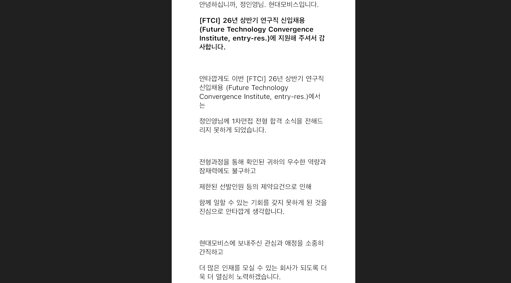

> 40개 기업에 지원한 개발자의 현대모비스 CI/CD/CT 면접 후기

> ##### 26 상반기 면접 후기
> - [LG CNS 금융 AX/DX 엔지니어 면접 후기 (최종 합격)](https://inyoung.dev/lg-cns-ax-dx-engineer-final-pass-review/)
> - [하나은행 AI/ICT 인턴 면접 후기 (최종 합격)](https://inyoung.dev/hana-bank-ai-ict-intern-final-pass-review/)
> - [현대자동차 모빌리티 서비스 개발 면접 후기 (최종 탈락)](https://inyoung.dev/hyundai-motor-mobility-service-development-interview-review/)
> - [현대모비스 CI/CD/CT 면접 후기](https://inyoung.dev/hyundai-mobis-cicdct-interview-review/)
> - [새마을금고중앙회 IT 면접 후기](https://inyoung.dev/saemaeulgeumgo-central-it-interview-review/)

#### 스펙

- 서성한 비전공자 & 소프트웨어 전공
- 학점: 4.07 / 4.5 (전공 4.18 / 4.5)
- 인턴: 핀테크 기업 어시스턴트 6개월, 스타트업 프론트엔드 개발 인턴 6개월
- 자격증: AWS Solutions Architect Associate, 정보처리기사, SQLD, 네트워크관리사 2급
- 어학: 오픽 IH, 토익 900+
- 수상: 교내 해커톤 대상, 정부기관 주최 해커톤 우수상

## 1️⃣ 지원 과정

#### 자소서

경험기술서 항목이 따로 있었는데, 공고에 명시된 기술스택과 역량 요구사항에 맞춰 그동안의 경험을 최대한 녹여서 작성했다.

#### 코딩테스트

구현 성격의 문제 3개, `BFS` 1문제, `Dijkstra`를 활용한 지하철 환승 최단경로 문제 1문제로 총 5문제가 나왔다. 

4솔한 거 같다.

## 2️⃣ PT 면접 구성

직무 역량 PT 면접이었고, 1:3(인사담당자 포함)으로 비대면으로 진행됐다. 30분 정도 걸렸다.

신입 DevOps 공고였어서 관련 경험을 어떻게 풀어낼지 고민을 많이 했다. 서비스 개발/운영하면서 `GitHub Actions`나 `Jenkins`를 가볍게 활용해본 경험과, 인턴하면서 DevOps 엔지니어와 함께 작업했던 경험을 엮어서 발표를 준비했다.

## 3️⃣ 받은 질문

기억나는 것은 아래와 같다.

- 프로젝트에서 맡은 역할 상세하게 설명
- 프로젝트 관련 질문
- `Jenkins` 설치 방법 설명
- 팀장으로서 팀을 이끌며 어려웠던 점
- 쿠버네티스 활용 경험이 있는지
- 쿠버네티스에 대해 아는 대로 다 말해보라
- 해외 경험으로 유럽 배낭여행을 쓴 이유
- 팀 협업을 선호하는지, 개인 프로젝트를 선호하는지
- 정말 솔직한 지원 동기
- 마지막 할 말

면접 분위기 자체는 나쁘지 않았지만, 질문 깊이는 전체적으로 얕아,, 보통 이러면 부정적인 결과로 나타낸다는 경우를 보아 기대를 하지 않았다.

## 4️⃣ 느낀 점

#### 우대사항에 나를 좀 더 끼워맞췄다면..?

공고 우대사항에 쿠버네티스 활용 경험이 명시되어 있었는데, 실제로 면접에서도 쿠버네티스 관련한 경험을 이끌어 내기 위한 질문들을 받았다. 우대사항이라고 적혀 있어도 가벼운 가산점 정도가 아니라, 실무 배치를 염두에 둔 핵심 검증 포인트일 수 있다는 걸 느꼈다. 
어차피 1-2명 채용 포지션일텐데니.. 우대사항도 Requirement 수준으로 생각하고, 면접 준비를 하는 게 좋을 거 같다.

만약 우대사항에 적힌 기술 스택을 프로젝트를 통해 경험하지 못하더라도, 최소한 개념 설명과 간단한 실습 경험 정도는 준비해가는 게 좋을 거 같다.

#### 대기실에서도 체감되는 경쟁 강도

같은 대기실에 LG CNS DevOps 경력직으로 지원한 분이 계셨다. 신입 공고인데도 경력직 지원자와 함께 면접을 보게 되는 경우가 있다는 걸 그때 알았고, 이런 구도라면 실무 역량 검증에서 상대적으로 불리할 수 있겠다는 생각이 들었다.

## 결과

1차 탈락했다 ㅎㅎ
