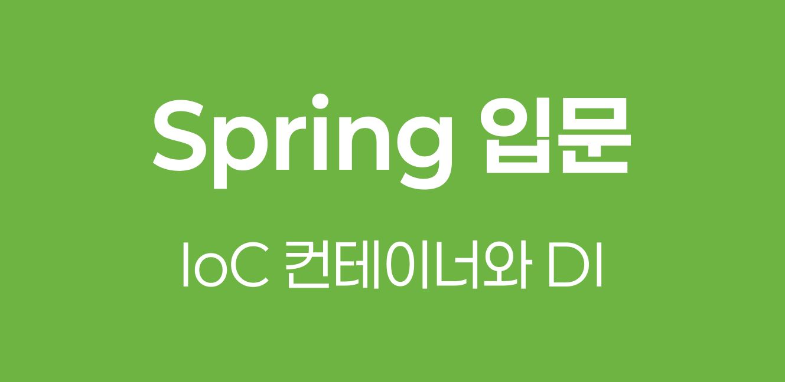

> Spring Framework를 처음 접하면 가장 먼저 마주치는 개념이 `IoC`와 `DI`입니다. 이 글에서는 Spring 내에서 객체의 제어권이 어떻게 이동하는지, 그리고 의존성 주입이 어떤 의미인지 다룹니다.

## 1️⃣ Inversion of Control

#### 1-1. IoC의 정의

`IoC`는 프로그램의 제어 흐름을 개발자가 직접 관리하지 않고 외부(프레임워크)에 위임하는 설계 원칙이다. 일반적인 프로그래밍에서는 개발자가 객체를 직접 생성하고 호출하지만, `IoC` 환경에서는 프레임워크가 객체의 생명주기를 관리한다.

#### 1-2. Library와 Framework의 차이

`IoC`의 적용 여부에 따라 라이브러리와 프레임워크를 구분할 수 있다.

| 구분          | 주도권 (Control) | 특징                                                     |
| ------------- | ---------------- | -------------------------------------------------------- |
| **Library**   | 개발자           | 개발자가 필요한 시점에 라이브러리를 직접 호출하여 사용함 |
| **Framework** | 프레임워크       | 프레임워크가 개발자의 코드를 호출하여 실행함             |

> 💡 **Hollywood Principle**
>
> "Don't call us, we'll call you(우리에게 전화하지 마세요, 우리가 당신에게 전화하겠습니다)."라는 원칙으로 `IoC`의 핵심을 설명한다. 객체는 수동적인 상태가 되며, 제어권을 가진 컨테이너가 적절한 시점에 객체를 사용한다.

## 2️⃣ Dependency Injection

#### 2-1. DI의 개념

`DI`는 `IoC` 원칙을 구현하는 구체적인 방법 중 하나로, 객체가 필요한 의존 객체를 직접 생성하지 않고 외부에서 주입받는 방식이다. 이를 통해 객체 간의 `결합도`(Coupling)를 낮출 수 있다.

> 💡 **결합도**
>
> 객체 지향의 대표 특성이자, 객체 간 의존성 정도를 나타내는 지표로, 낮을수록 유연한 설계가 가능하다. `DI`를 사용하면 객체가 자신의 의존성을 알 필요 없이 외부에서 주입받기 때문에 결합도가 낮아진다.

#### 2-2. 의존성 주입의 3가지 방식

Spring에서는 주로 세 가지 방식으로 의존성을 주입한다.

- **⭐️Constructor Injection**: 생성자를 통해 의존성을 주입한다. (Best practice)
- **Setter Injection**: `Setter` 메서드를 통해 의존성을 주입한다.
- **Field Injection**: 필드에 직접 `@Autowired` 어노테이션을 사용하여 주입한다.

##### 2-2-1. Constructor Injection 예시

Spring에서 가장 권장되는 방식이다. 객체 생성 시점에 의존성이 주입되므로 `불변성`을 확보할 수 있다.

```java
// UserService.java
public class UserService {
    private final UserRepository userRepository;

    // 생성자를 통한 주입 (Constructor Injection)
    public UserService(UserRepository userRepository) {
        this.userRepository = userRepository;
    }

    public void join(User user) {
        userRepository.save(user); // 주입된 객체를 사용
    }
}

```

## 3️⃣ Spring IoC Container와 Bean

#### 3-1. Bean의 정의

Spring이 제어권을 가지고 직접 관리하는 자바 객체를 `Bean`이라고 부른다. 일반적인 `new` 연산자로 생성한 객체는 `Bean`이 아니다.

#### 3-2. ApplicationContext

`ApplicationContext`는 Spring에서 `IoC Container` 역할을 수행하는 핵심 인터페이스이다. `Bean`의 등록, 생성, 조회, 소멸 등 전체적인 생명주기를 관리한다.

> 💡 **Bean Definition**
> 
> Spring은 설정 정보(XML, Annotation, Java Config)를 읽어 `BeanDefinition`을 생성한다. `IoC Container`는 이 정보를 바탕으로 객체를 인스턴스화한다.

## 4️⃣ IoC와 DI를 사용하는 이유

#### 4-1. 유연성과 확장성

객체가 구체적인 클래스에 의존하지 않고 인터페이스에 의존하게 함으로써, 구현체가 변경되어도 클라이언트 코드를 수정할 필요가 없다.

#### 4-2. 테스트 용이성

의존성을 외부에서 주입하기 때문에, 단위 테스트 수행 시 실제 객체 대신 Mock Object를 주입하여 테스트하기 수월하다.

```java
// 테스트 코드 예시
public class UserServiceTest {
    @Test
    public void testJoin() {
        // 실제 DB와 연결된 Repository 대신 가짜 객체를 주입
        UserRepository mockRepository = new MockUserRepository();
        UserService userService = new UserService(mockRepository);

        userService.join(new User("testUser"));
        // 검증 로직 수행
    }
}

```
