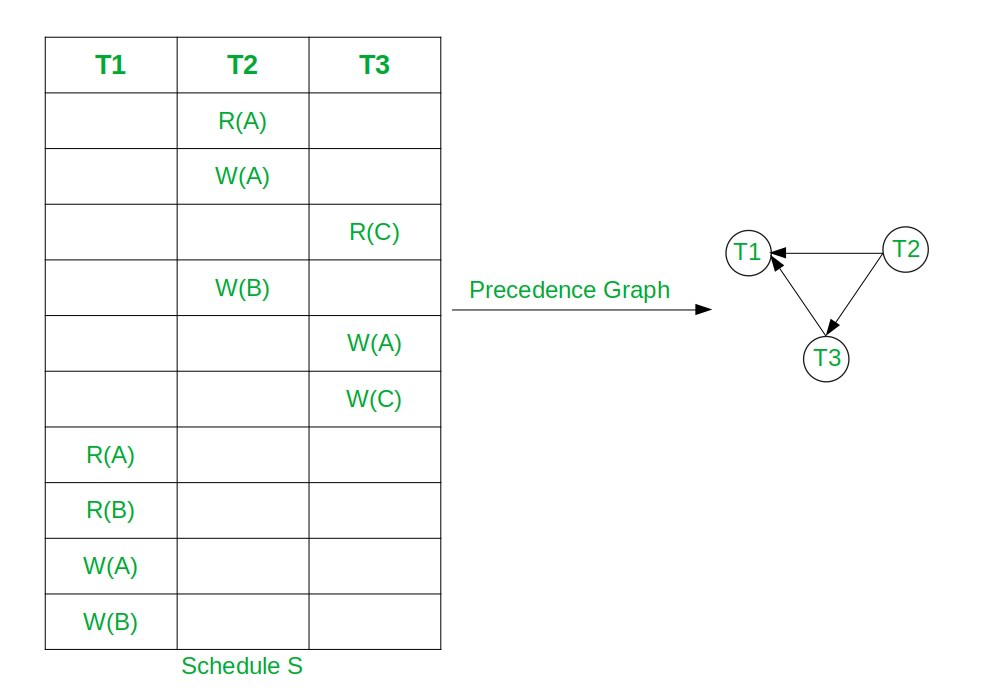
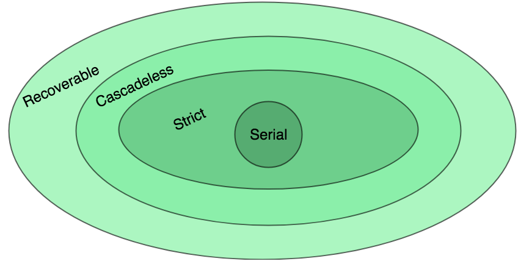

> 여러 트랜잭션이 동시에 실행될 때 데이터 일관성이 깨질 수 있다.
>
> `Schedule`의 개념과 종류, 그리고 `Concurrency Control`이 지향하는 두 가지 목표인 `Serializability`와 `Recoverability`에 대해 개괄적으로 정리해보자.


## 1️⃣ 동시 실행되는 트랜잭션 문제

데이터베이스는 여러 사용자의 요청을 동시에 처리하기 위해 트랜잭션을 **병렬**로 실행한다. 이때 동일한 데이터에 여러 트랜잭션이 접근하면 다음과 같은 문제가 발생할 수 있다.

| 문제                  | 설명                                                                     |
| --------------------- | ------------------------------------------------------------------------ |
| `Dirty Read`          | 아직 commit되지 않은 데이터를 다른 트랜잭션이 읽는 문제                  |
| `Lost Update`         | 두 트랜잭션이 같은 데이터를 동시에 수정하여 한 쪽의 수정이 사라지는 문제 |
| `Non-repeatable Read` | 같은 트랜잭션 내에서 같은 데이터를 두 번 읽었을 때 값이 다른 문제        |
| `Phantom Read`        | 같은 조건의 쿼리를 두 번 실행했을 때 결과 행 수가 달라지는 문제          |

이러한 이상 현상들을 방지하기 위해 `Concurrency Control(동시성 제어)`이 필요하다.

각 Isolation level 별 자세한 사항은 다음 글을 참고하자. [➡️ 트랜잭션 격리 수준 4단계 쉽게 이해하기](http://inyoung.dev/database-isolation-level/)

## 2️⃣ 스케줄(Schedule)이란 무엇인가

`스케줄`은 여러 트랜잭션의 operation들이 실행되는 **전체 순서**를 의미한다.

각 트랜잭션 내부 operation들의 상대적 순서는 유지되지만, 서로 다른 트랜잭션의 operation은 interleave될 수 있다.

```java
// T1: X에서 20을 읽어 Y에 더함
// T2: X에서 30을 읽어 X에 씀

// Schedule 예시 (interleaved)
T1: read(X)
T2: read(X)
T1: write(Y)
T2: write(X)
T1: commit
T2: commit
```

위와 같이 두 트랜잭션의 operation이 섞여 실행되는 것이 하나의 Schedule이다.

> 💡 **Operation의 종류**
>
> `read(X)`: 데이터 X를 DB에서 읽어 메모리에 올림
>
> `write(X)`: 메모리에서 수정한 X를 DB에 반영
>
> `commit`: 트랜잭션의 모든 변경을 영구 반영
>
> `rollback`: 트랜잭션의 모든 변경을 취소

## 3️⃣ Serial Schedule

`Serial Schedule`은 트랜잭션들이 **겹치지 않고 순차적으로** 실행되는 Schedule이다.

```java
// T1이 완전히 끝난 후 T2 실행 → Serial Schedule
T1: read(X) → write(Y) → commit
T2: read(X) → write(X) → commit
```

- 항상 데이터 일관성을 보장한다.
- 그러나 한 트랜잭션이 끝날 때까지 다른 트랜잭션이 대기해야 하므로 성능이 낮다.
- I/O 대기 중에도 CPU를 활용할 수 없어 자원 효율이 떨어진다.

실제 시스템에서 Serial Schedule만 허용하는 것은 성능적으로 포기할 부분이 많기에, **결과적으로 Serial Schedule과 동등한** Schedule을 허용하는 방향으로 설계한다.

## 4️⃣ Serializable Schedule

`Serializable Schedule`은 **어떤 Serial Schedule과 동등한 결과를 내는 Schedule**이다.

interleave 방식으로 실행되더라도 그 결과가 어떤 Serial Schedule의 결과와 동일하다면, 올바른 Schedule로 간주한다.

- **동시성은 높이면서도 데이터 일관성은 유지**할 수 있다.
- 두 Schedule이 "동등하다"는 것은, 모든 트랜잭션이 동일한 데이터에 같은 최종 값을 쓰고 읽는다는 의미다.

## 5️⃣ Conflict Serializability

Serializability를 판단하는 실용적인 기준이 `Conflict Serializability`다.

### Conflict란?

두 operation이 다음 조건을 **모두** 만족할 때 conflict라 한다.

- 서로 **다른 트랜잭션**에 속한다.
- **같은 데이터**에 접근한다.
- 적어도 **하나가 `write`** 이다.

| 조합        | Conflict 여부 |
| ----------- | ------------- |
| read-read   | ❌            |
| read-write  | ✅            |
| write-read  | ✅            |
| write-write | ✅            |

### Conflict Equivalent

두 Schedule에서 **non-conflict operation들의 순서를 swap**하여 동일한 Schedule로 변환 가능하면 `Conflict Equivalent`하다고 한다.
즉, **conflict operation들의 상대적 순서는 유지**되어야 한다.

### Conflict Serializable

어떤 Schedule이 **Conflict Equivalent한 Serial Schedule이 존재**하면 `Conflict Serializable`이라 한다.




## 6️⃣ Recoverability

`Recoverability`는 트랜잭션이 실패했을 때 **정상적으로 rollback 가능한지**에 관한 개념이다. Schedule이 올바른 결과를 내더라도, 장애 발생 시 복구가 불가능하면 문제가 된다.

#### 6-1 Unrecoverable Schedule

`Unrecoverable Schedule`은 **rollback이 불가능한** Schedule이다.

```java
// T1이 write한 데이터를 T2가 read하고 commit했는데, T1이 rollback되는 경우
T1: write(A)       // T1이 A를 수정
T2: read(A)        // T2가 T1의 미완성 데이터를 읽음
T2: commit         // T2 먼저 commit
T1: rollback       // T1 rollback → T2가 읽은 데이터는 이미 사라진 값
```

T2는 이미 commit되었으므로 되돌릴 수 없다. 데이터베이스는 **Unrecoverable Schedule이 발생하지 않도록 보장**해야 한다.

#### 6-2 Recoverable Schedule

`Recoverable Schedule`은 **자신이 읽은 데이터를 write한 트랜잭션이 먼저 commit될 때까지 commit을 미루는** Schedule이다.

```java
T1: write(A)
T2: read(A)        // T2가 T1의 데이터를 읽음
T1: commit         // T1이 먼저 commit
T2: commit         // 그 후 T2 commit
```

T1이 rollback되더라도 T2가 아직 commit 전이므로 함께 rollback이 가능하다.

#### 6-3 Cascading Rollback

`Cascading Rollback`은 하나의 트랜잭션이 rollback될 때, 그 트랜잭션이 write한 데이터를 읽은 다른 트랜잭션들도 **연쇄적으로 rollback**되는 현상이다.

```java
T1: write(A)
T2: read(A)        // T2가 T1의 데이터에 의존
T3: read(A)        // T3도 T1의 데이터에 의존
T1: rollback       // T1 rollback → T2, T3도 모두 rollback 필요
```

- Recoverable Schedule이라도 Cascading Rollback이 발생할 수 있다.
- rollback 범위가 넓어지면 성능에 큰 영향을 미친다.

#### 6-4 Cascadeless / Strict Schedule

Cascading Rollback을 방지하기 위한 더 엄격한 Schedule 조건이다.

##### Cascadeless Schedule

`commit되지 않은 트랜잭션이 write한 데이터를 read하지 않는` Schedule이다.

```java
// Cascadeless: T1이 commit된 후에만 T2가 A를 읽을 수 있음
T1: write(A)
T1: commit
T2: read(A)        // commit된 데이터만 읽음
```

##### Strict Schedule

`commit되지 않은 트랜잭션이 write한 데이터를 read하거나 write하지 않는` Schedule이다.

- Cascadeless Schedule보다 더 엄격한 조건이다.
- rollback 시 이전 값으로 단순 복원이 가능하여 구현이 용이하다.

| Schedule 종류            | 특징                                      | 포함 관계                 |
| ------------------------ | ----------------------------------------- | ------------------------- |
| `Strict Schedule`        | uncommitted 데이터 read/write 모두 금지   | 가장 엄격                 |
| `Cascadeless Schedule`   | uncommitted 데이터 read 금지              | Strict ⊂ Cascadeless      |
| `Recoverable Schedule`   | 의존한 트랜잭션이 commit 후 자신도 commit | Cascadeless ⊂ Recoverable |
| `Unrecoverable Schedule` | rollback 불가                             | 허용되어선 안 됨          |



## 7️⃣ Concurrency Control의 목표

`Concurrency Control`은 결국 두 가지 목표를 동시에 달성하는 것을 목표로 한다!

#### 7-1 Serializability

실행되는 Schedule이 **어떤 Serial Schedule과 동등한 결과**를 내도록 보장하는 것이다.

- 동시성을 허용하면서도 트랜잭션 간 간섭으로 인한 데이터 이상을 방지한다.
- 실질적으로는 Conflict Serializability를 기준으로 구현된다.

#### 7-2 Recoverability

**rollback이 항상 정상적으로 가능**하도록 Schedule을 제어하는 것이다.

- Unrecoverable Schedule은 절대 허용하지 않는다.
- 가능하면 Cascadeless 또는 Strict Schedule을 지향하여 성능 저하도 최소화한다.

두 목표를 모두 만족하는 Schedule만이 안전한 동시 실행을 보장한다.

우리가 들어본 `Lock`, `MVCC` 같은 메커니즘은 이 두 가지 목표를 달성하기 위한 수단이다.
