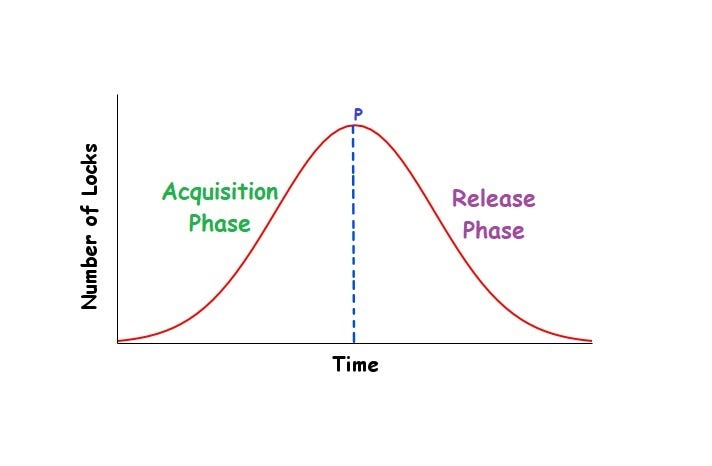

> `동시성 제어`의 목표는 `Serializability`와 `Recoverability`를 보장하는 것이다. 
> `Lock`은 이를 달성하기 위한 가장 고전적인 방법으로, 데이터에 접근할 때 명시적으로 잠금을 걸어 다른 트랜잭션의 접근을 제어한다.


## 1️⃣ Lock 기반 동시성 제어

`Lock`은 트랜잭션이 데이터에 접근하기 전에 **잠금을 획득**하고, 사용이 끝나면 **잠금을 해제**하는 방식으로 동시성을 제어한다.

- 잠금을 획득한 트랜잭션만 해당 데이터에 접근할 수 있다.
- 다른 트랜잭션은 잠금이 해제될 때까지 대기한다.
- 이를 통해 트랜잭션 간 간섭을 제어하고 이상 현상을 방지한다.

운영체제의 뮤텍스 락과 비슷한 개념이다.

## 2️⃣ Shared Lock / Exclusive Lock

Lock에는 접근 목적에 따라 두 가지 종류가 있다.

#### 2-1 Shared Lock (S-Lock)

`Shared Lock`은 **읽기 전용** 잠금이다.

- `read` 작업을 수행할 때 획득한다.
- 여러 트랜잭션이 동시에 같은 데이터에 S-Lock을 획득할 수 있다.
- S-Lock이 걸린 데이터에는 `write`가 불가하다.

#### 2-2 Exclusive Lock (X-Lock)

`Exclusive Lock`은 **읽기/쓰기** 모두를 위한 배타적 잠금이다.

- `write` 작업을 수행할 때 획득한다.
- X-Lock을 획득한 트랜잭션만 해당 데이터에 접근할 수 있다.
- 다른 트랜잭션은 S-Lock도 X-Lock도 획득할 수 없다.

## 3️⃣ Lock Compatibility

두 트랜잭션이 같은 데이터에 동시에 Lock을 획득할 수 있는지를 `Lock Compatibility`라 한다.

| | S-Lock | X-Lock |
|---|---|---|
| **S-Lock** | ✅ 호환 | ❌ 불호환 |
| **X-Lock** | ❌ 불호환 | ❌ 불호환 |

- S-Lock끼리는 동시에 획득 가능하다.
- X-Lock이 포함된 경우, 어떤 Lock과도 함께 획득할 수 없다.

> 💡 **왜 read-read는 호환되는가?**
>
> 두 트랜잭션이 모두 읽기만 수행한다면 데이터를 변경하지 않으므로 서로 영향을 주지 않는다. 따라서 S-Lock끼리는 동시에 허용해도 이상 현상이 발생하지 않는다.

## 4️⃣ 2PL (Two-Phase Locking)

하지만 Lock을 사용한다고 해서 무조건 `Serializability`가 보장되지는 않는다. Lock의 **획득과 해제 순서**를 규칙으로 통제해야 한다. 이 규칙이 `2PL(Two-Phase Locking)`이다.

### 2PL의 두 단계

2PL은 트랜잭션의 Lock 작업을 두 단계로 제한한다.

| 단계 | 이름 | 허용 작업 |
|---|---|---|
| Phase 1 | **Growing Phase** | Lock 획득만 가능, 해제 불가 |
| Phase 2 | **Shrinking Phase** | Lock 해제만 가능, 획득 불가 |

```java
// 2PL을 따르는 트랜잭션 흐름
lock(A)      // Growing Phase: Lock 획득
lock(B)      // Growing Phase: Lock 획득
read(A)
write(B)
unlock(A)    // Shrinking Phase: Lock 해제 시작
unlock(B)    // Shrinking Phase: Lock 해제
commit
```

**Lock point**: Growing Phase에서 Shrinking Phase로 넘어가는 시점. 이 시점 이후로는 새로운 Lock을 획득할 수 없다.



### 2PL과 Serializability

2PL을 따르는 트랜잭션들의 Schedule은 **항상 Conflict Serializable**하다.

그러나 2PL만으로는 Recoverability가 보장되지 않는다. Dirty Read나 Cascading Rollback이 여전히 발생할 수 있다. 이를 해결하기 위한 변형 프로토콜들이 존재한다.

## 5️⃣ Conservative 2PL

`Conservative 2PL`은 트랜잭션 시작 전에 **필요한 모든 Lock을 한꺼번에 획득**하는 방식이다.

```java
// 트랜잭션 시작 전 모든 Lock 선점
lock(A)
lock(B)
lock(C)
// --- 이후 Growing Phase 없음, 바로 작업 ---
read(A)
write(B)
write(C)
unlock(A)
unlock(B)
unlock(C)
commit
```

- `Deadlock`이 발생하지 않는다. 모든 Lock을 한 번에 확보하므로 순환 대기가 생기지 않는다.
- 그러나 실제로 어떤 데이터가 필요한지 **미리 알기 어렵고**, 필요 이상으로 Lock을 오래 점유해 `동시성`이 낮아진다.

## 6️⃣ Strict 2PL

`Strict 2PL`은 `X-Lock`을 `commit` 또는 `rollback` 시점까지 유지하는 방식이다.

```java
lock_shared(A)       // S-Lock 획득
lock_exclusive(B)    // X-Lock 획득
read(A)
write(B)
unlock(A)            // S-Lock은 중간에 해제 가능
// X-Lock은 commit 전까지 유지
commit
unlock(B)            // commit 후 X-Lock 해제
```

- `Recoverability`가 보장된다. X-Lock을 commit 전까지 유지하므로, 다른 트랜잭션은 commit되지 않은 write 데이터를 읽을 수 없다.
- `Strict Schedule`을 구현하는 가장 일반적인 방법이다.
- `Deadlock`은 여전히 발생할 수 있다.

## 7️⃣ Rigorous 2PL

`Rigorous 2PL`은 **모든 Lock(S-Lock, X-Lock 모두)을 commit 또는 rollback 시점까지 유지**하는 방식이다.

```java
lock_shared(A)
lock_exclusive(B)
read(A)
write(B)
// S-Lock, X-Lock 모두 commit 전까지 해제하지 않음
commit
unlock(A)    // commit 후 모든 Lock 해제
unlock(B)
```

- Strict 2PL보다 더 엄격한 제약을 가진다.
- `Cascading Rollback`이 발생하지 않는다.
- 구현이 단순하지만 Lock을 오래 유지하여 **동시성이 더 낮다.**

### 2PL 변형 비교

| 프로토콜 | Deadlock 방지 | Recoverability | 동시성 |
|---|---|---|---|
| `2PL` | ❌ | ❌ | 높음 |
| `Conservative 2PL` | ✅ | ❌ | 낮음 |
| `Strict 2PL` | ❌ | ✅ (Strict) | 중간 |
| `Rigorous 2PL` | ❌ | ✅ (Cascadeless) | 낮음 |

## 8️⃣ Lock 기반 방식의 한계

#### 8-1 Blocking

Lock을 획득하지 못한 트랜잭션은 Lock이 해제될 때까지 **대기 상태(Blocking)** 에 빠진다.

- 특정 트랜잭션이 Lock을 오래 점유하면, 이를 기다리는 트랜잭션들이 모두 멈춘다.
- Lock 점유 시간이 길수록 전체 처리량이 떨어진다.

#### 8-2 Deadlock

`Deadlock`은 두 트랜잭션이 **서로 상대방이 가진 Lock을 기다리며 무한히 대기**하는 상황이다.

```java
// T1이 A를 Lock, T2가 B를 Lock한 상태에서 서로의 자원을 요청
T1: lock(A) → lock(B) 대기   // B는 T2가 점유 중
T2: lock(B) → lock(A) 대기   // A는 T1이 점유 중
// T1, T2 모두 영원히 대기 → Deadlock
```

Deadlock을 해결하는 방법은 크게 두 가지가 있다.

- `Deadlock Detection`: 주기적으로 cycle을 탐지하고, cycle에 속한 트랜잭션 중 하나를 강제 rollback한다.
- `Deadlock Prevention`: Conservative 2PL처럼 Lock을 미리 획득하거나, 타임아웃 기반으로 대기를 제한한다.


#### 8-3 낮은 동시성

Lock 기반 방식은 본질적으로 **트랜잭션 간 경합** 이 발생하면 대기가 생긴다.

- read-read 이외에는 모두 Lock을 두고 경합한다.
- 트랜잭션 수가 많아질수록 Blocking과 Deadlock 발생 빈도가 높아진다.
- 이 한계를 극복하기 위해 `MVCC(Multi-Version Concurrency Control)` 와 같은 방식이 등장했다. MVCC는 데이터의 버전을 관리하여 read 작업이 write를 차단하지 않도록 한다.
