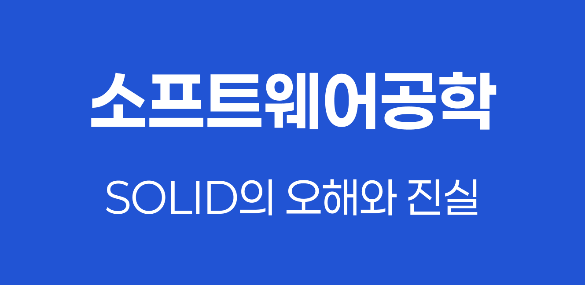

> 객체 지향 설계의 기본이 되는 `SOLID 원칙`은 응집성을 높이고 결합도를 낮춰 유지보수가 용이한 코드를 작성하기 위한 5가지 설계 원칙입니다. 각 원칙의 목적과 실제 적용 방법을 살펴봅니다.



## SOLID 원칙이란

`SOLID`는 객체 지향 프로그래밍에서 지켜야 할 5가지 핵심 설계 원칙의 앞글자를 딴 약어이다.

| 원칙    | 영문                            | 한글                 |
| ------- | ------------------------------- | -------------------- |
| **S**RP | Single Responsibility Principle | 단일 책임 원칙       |
| **O**CP | Open-Closed Principle           | 개방-폐쇄 원칙       |
| **L**SP | Liskov Substitution Principle   | 리스코프 치환 원칙   |
| **I**SP | Interface Segregation Principle | 인터페이스 분리 원칙 |
| **D**IP | Dependency Inversion Principle  | 의존성 역전 원칙     |

이 원칙들을 지키면 다음과 같은 이점을 얻을 수 있다:

- **응집성 향상**: 관련된 기능이 하나의 모듈에 집중
- **결합도 감소**: 모듈 간 의존성 최소화
- **유지보수성 향상**: 변경 시 영향 범위 최소화
- **확장성 향상**: 새로운 기능 추가 용이

## 1️⃣ SRP (Single Responsibility Principle)

#### 1-1. 원칙의 정의

`SRP`는 하나의 클래스는 하나의 책임만 가져야 한다는 원칙이다. 여기서 **책임**이란 **변경의 이유**를 의미한다. 즉, 클래스가 변경되어야 하는 이유는 단 하나여야 한다.

#### 1-2. 왜 필요한가

하나의 클래스가 여러 책임을 가지면 다음과 같은 문제가 발생한다:

- 한 책임의 변경이 다른 책임에 영향을 미침
- 코드의 결합도가 높아져 유지보수가 어려워짐
- 테스트 작성이 복잡해짐

#### 1-3. 위반 예시

```java
// ❌ SRP 위반: Employee 클래스가 여러 책임을 가짐
class Employee {
    private String name;
    private String department;
    private int salary;

    // 책임 1: 급여 계산
    public int calculatePay() {
        // 급여 계산 로직
        return salary * 12;
    }

    // 책임 2: 데이터베이스 저장
    public void save() {
        // DB 저장 로직
        System.out.println("Saving to database...");
    }

    // 책임 3: 보고서 생성
    public String generateReport() {
        // 보고서 생성 로직
        return "Employee Report: " + name;
    }
}
```

위 코드는 세 가지 변경 이유를 가진다:

1. 급여 계산 로직이 변경될 때
2. 데이터베이스 구조가 변경될 때
3. 보고서 포맷이 변경될 때

#### 1-4. 개선 예시

```java
// ✅ SRP 준수: 각 클래스가 하나의 책임만 가짐
class Employee {
    private String name;
    private String department;
    private int salary;

    // 기본적인 직원 정보만 관리
    public String getName() { return name; }
    public int getSalary() { return salary; }
}

// 책임 1: 급여 계산
class PayrollCalculator {
    public int calculatePay(Employee employee) {
        return employee.getSalary() * 12;
    }
}

// 책임 2: 데이터베이스 저장
class EmployeeRepository {
    public void save(Employee employee) {
        System.out.println("Saving " + employee.getName() + " to database...");
    }
}

// 책임 3: 보고서 생성
class EmployeeReportGenerator {
    public String generateReport(Employee employee) {
        return "Employee Report: " + employee.getName();
    }
}
```

## 2️⃣ OCP (Open-Closed Principle)

#### 2-1. 원칙의 정의

`OCP`는 소프트웨어 요소는 **확장에는 열려 있어야 하고, 변경에는 닫혀 있어야 한다**는 원칙이다.

- **확장에 열려 있다**: 새로운 기능을 추가할 수 있다
- **변경에 닫혀 있다**: 기존 코드를 수정하지 않는다

#### 2-2. 왜 필요한가

기존 코드를 수정하면:

- 버그가 발생할 위험이 높아짐
- 기존 기능이 의도치 않게 변경될 수 있음
- 다른 모듈에 영향을 미칠 수 있음

`OCP`를 지키면 새로운 기능 추가 시 기존 코드의 안정성을 유지할 수 있다.

#### 2-3. 위반 예시

```java
// ❌ OCP 위반: 새로운 결제 수단 추가 시 기존 코드 수정 필요
class PaymentProcessor {
    public void processPayment(String paymentType, int amount) {
        if (paymentType.equals("CARD")) {
            System.out.println("카드로 " + amount + "원 결제");
        } else if (paymentType.equals("BANK")) {
            System.out.println("계좌이체로 " + amount + "원 결제");
        } else if (paymentType.equals("KAKAO")) {
            System.out.println("카카오페이로 " + amount + "원 결제");
        }
        // 새로운 결제 수단이 추가될 때마다 이 메서드를 수정해야 함
    }
}
```

#### 2-4. 개선 예시

```java
// ✅ OCP 준수: 인터페이스를 활용한 확장 가능한 설계
interface PaymentMethod {
    void process(int amount);
}

class CardPayment implements PaymentMethod {
    @Override
    public void process(int amount) {
        System.out.println("카드로 " + amount + "원 결제");
    }
}

class BankTransferPayment implements PaymentMethod {
    @Override
    public void process(int amount) {
        System.out.println("계좌이체로 " + amount + "원 결제");
    }
}

class KakaoPayment implements PaymentMethod {
    @Override
    public void process(int amount) {
        System.out.println("카카오페이로 " + amount + "원 결제");
    }
}

class PaymentProcessor {
    public void processPayment(PaymentMethod paymentMethod, int amount) {
        // 기존 코드 수정 없이 새로운 결제 수단 추가 가능
        paymentMethod.process(amount);
    }
}

// 사용 예시
public class Main {
    public static void main(String[] args) {
        PaymentProcessor processor = new PaymentProcessor();

        processor.processPayment(new CardPayment(), 10000);
        processor.processPayment(new BankTransferPayment(), 20000);

        // 새로운 결제 수단 추가 시 PaymentProcessor 수정 불필요
        processor.processPayment(new KakaoPayment(), 15000);
    }
}
```

## 3️⃣ LSP (Liskov Substitution Principle)

#### 3-1. 원칙의 정의

`LSP`는 서브 타입(자식 클래스)은 언제나 자신의 기반 타입(부모 클래스)으로 교체할 수 있어야 한다는 원칙이다. 즉, 부모 클래스의 인스턴스 대신 자식 클래스의 인스턴스를 사용해도 프로그램이 정상적으로 동작해야 한다.

#### 3-2. 왜 필요한가

`LSP`를 위반하면:

- 상속을 사용한 다형성이 제대로 작동하지 않음
- 예상치 못한 버그 발생
- 코드의 신뢰성 저하

#### 3-3. 위반 예시: 직사각형-정사각형 문제

```java
// ❌ LSP 위반: 정사각형은 직사각형의 행동을 제대로 대체하지 못함
class Rectangle {
    protected int width;
    protected int height;

    public void setWidth(int width) {
        this.width = width;
    }

    public void setHeight(int height) {
        this.height = height;
    }

    public int getArea() {
        return width * height;
    }
}

class Square extends Rectangle {
    @Override
    public void setWidth(int width) {
        this.width = width;
        this.height = width;  // 정사각형은 가로와 세로가 같아야 함
    }

    @Override
    public void setHeight(int height) {
        this.width = height;
        this.height = height;
    }
}

// 테스트 코드
public class Main {
    public static void testRectangle(Rectangle rectangle) {
        rectangle.setWidth(5);
        rectangle.setHeight(4);

        // 직사각형이라면 넓이는 20이어야 함
        int expectedArea = 5 * 4;  // 20
        int actualArea = rectangle.getArea();

        System.out.println("예상 넓이: " + expectedArea);
        System.out.println("실제 넓이: " + actualArea);

        if (expectedArea != actualArea) {
            System.out.println("LSP 위반!");
        }
    }

    public static void main(String[] args) {
        testRectangle(new Rectangle());  // 정상 작동
        testRectangle(new Square());     // LSP 위반! (넓이: 16)
    }
}
```

`Square`를 `Rectangle` 대신 사용했을 때 예상과 다른 결과가 나온다. 이는 `Square`가 `Rectangle`의 행동 규약을 깨뜨렸기 때문이다.

#### 3-4. 개선 예시

```java
// ✅ LSP 준수: 상속 대신 인터페이스 분리
interface Shape {
    int getArea();
}

class Rectangle implements Shape {
    private int width;
    private int height;

    public Rectangle(int width, int height) {
        this.width = width;
        this.height = height;
    }

    public void setWidth(int width) {
        this.width = width;
    }

    public void setHeight(int height) {
        this.height = height;
    }

    @Override
    public int getArea() {
        return width * height;
    }
}

class Square implements Shape {
    private int side;

    public Square(int side) {
        this.side = side;
    }

    public void setSide(int side) {
        this.side = side;
    }

    @Override
    public int getArea() {
        return side * side;
    }
}
```

> 💡 **LSP를 지키는 방법**
>
> - 부모 클래스의 **사전 조건**(precondition)을 강화하지 않는다
> - 부모 클래스의 **사후 조건**(postcondition)을 약화시키지 않는다
> - 부모 클래스의 **불변 조건**(invariant)을 유지한다
> - 상속보다는 `Composition`을 고려한다

## 4️⃣ ISP (Interface Segregation Principle)

#### 4-1. 원칙의 정의

`ISP`는 클라이언트가 사용하지 않는 메서드에 의존하지 않아야 한다는 원칙이다. 즉, **큰 인터페이스보다는 작고 구체적인 여러 개의 인터페이스가 낫다**.

#### 4-2. 왜 필요한가

거대한 인터페이스를 사용하면:

- 사용하지 않는 메서드까지 구현해야 함
- 불필요한 의존성 발생
- 인터페이스 변경 시 영향 범위가 커짐

#### 4-3. 위반 예시

```java
// ❌ ISP 위반: 모든 기능이 하나의 인터페이스에 집중
interface Worker {
    void work();
    void eat();
    void sleep();
}

class HumanWorker implements Worker {
    @Override
    public void work() {
        System.out.println("사람이 일합니다");
    }

    @Override
    public void eat() {
        System.out.println("사람이 식사합니다");
    }

    @Override
    public void sleep() {
        System.out.println("사람이 잡니다");
    }
}

class RobotWorker implements Worker {
    @Override
    public void work() {
        System.out.println("로봇이 일합니다");
    }

    @Override
    public void eat() {
        // 로봇은 식사를 하지 않지만 구현해야 함
        throw new UnsupportedOperationException("로봇은 식사하지 않습니다");
    }

    @Override
    public void sleep() {
        // 로봇은 잠을 자지 않지만 구현해야 함
        throw new UnsupportedOperationException("로봇은 잠을 자지 않습니다");
    }
}
```

#### 4-4. 개선 예시

```java
// ✅ ISP 준수: 인터페이스를 역할별로 분리
interface Workable {
    void work();
}

interface Eatable {
    void eat();
}

interface Sleepable {
    void sleep();
}

class HumanWorker implements Workable, Eatable, Sleepable {
    @Override
    public void work() {
        System.out.println("사람이 일합니다");
    }

    @Override
    public void eat() {
        System.out.println("사람이 식사합니다");
    }

    @Override
    public void sleep() {
        System.out.println("사람이 잡니다");
    }
}

class RobotWorker implements Workable {
    @Override
    public void work() {
        System.out.println("로봇이 일합니다");
    }
    // 로봇은 Workable만 구현하면 됨
}

// 사용 예시
public class Main {
    public static void main(String[] args) {
        Workable human = new HumanWorker();
        Workable robot = new RobotWorker();

        human.work();
        robot.work();

        // HumanWorker만 Eatable을 구현하므로 타입 캐스팅 필요
        if (human instanceof Eatable) {
            ((Eatable) human).eat();
        }
    }
}
```

## 5️⃣ DIP (Dependency Inversion Principle)

#### 5-1. 원칙의 정의

`DIP`는 다음 두 가지를 의미한다:

1. 고수준 모듈은 저수준 모듈에 의존해서는 안 된다. **둘 다 추상화에 의존해야 한다**.
2. 추상화는 세부 사항에 의존해서는 안 된다. **세부 사항이 추상화에 의존해야 한다**.

> 💡 **고수준 모듈과 저수준 모듈**
>
> - **고수준 모듈**: 비즈니스 로직을 담당하는 상위 수준의 정책
> - **저수준 모듈**: 구체적인 구현을 담당하는 하위 수준의 세부 사항
>
> 예를 들어, "주문 처리" 비즈니스 로직은 고수준 모듈이고, "MySQL 데이터베이스에 저장"은 저수준 모듈이다.

#### 5-2. 왜 필요한가

고수준 모듈이 저수준 모듈에 직접 의존하면:

- 저수준 모듈 변경 시 고수준 모듈도 함께 변경됨
- 테스트가 어려워짐 (실제 DB, 외부 API 등에 의존)
- 재사용성이 떨어짐

`DIP`를 적용하면 **의존성의 방향이 역전**되어 안정성이 높아진다.

#### 5-3. 위반 예시

```java
// ❌ DIP 위반: 고수준 모듈이 저수준 모듈에 직접 의존
class MySQLDatabase {
    public void save(String data) {
        System.out.println("MySQL에 저장: " + data);
    }
}

class OrderService {
    private MySQLDatabase database;

    public OrderService() {
        this.database = new MySQLDatabase();  // 구체적인 클래스에 직접 의존
    }

    public void createOrder(String orderData) {
        // 주문 처리 로직
        System.out.println("주문 생성: " + orderData);

        // MySQL에 저장
        database.save(orderData);
    }
}
```

위 코드의 문제점:

- `OrderService`가 `MySQLDatabase`에 강하게 결합됨
- 데이터베이스를 PostgreSQL로 변경하려면 `OrderService` 수정 필요
- 테스트 시 실제 MySQL이 필요함

#### 5-4. 개선 예시

```java
// ✅ DIP 준수: 추상화에 의존
interface Database {
    void save(String data);
}

// 저수준 모듈: 구체적인 구현
class MySQLDatabase implements Database {
    @Override
    public void save(String data) {
        System.out.println("MySQL에 저장: " + data);
    }
}

class PostgreSQLDatabase implements Database {
    @Override
    public void save(String data) {
        System.out.println("PostgreSQL에 저장: " + data);
    }
}

class MongoDatabase implements Database {
    @Override
    public void save(String data) {
        System.out.println("MongoDB에 저장: " + data);
    }
}

// 고수준 모듈: 비즈니스 로직
class OrderService {
    private Database database;

    // 의존성 주입(Dependency Injection)
    public OrderService(Database database) {
        this.database = database;
    }

    public void createOrder(String orderData) {
        System.out.println("주문 생성: " + orderData);
        database.save(orderData);
    }
}

// 사용 예시
public class Main {
    public static void main(String[] args) {
        // 런타임에 구체적인 구현 결정
        Database mysqlDb = new MySQLDatabase();
        OrderService orderService1 = new OrderService(mysqlDb);
        orderService1.createOrder("Order #1");

        // 데이터베이스 변경이 쉬움
        Database mongoDb = new MongoDatabase();
        OrderService orderService2 = new OrderService(mongoDb);
        orderService2.createOrder("Order #2");
    }
}
```

#### 5-5. 의존성 역전의 의미

```
기존 의존성 방향:
OrderService → MySQLDatabase (고수준 → 저수준)

DIP 적용 후:
OrderService → Database ← MySQLDatabase
(고수준 → 추상화 ← 저수준)
```

인터페이스(`Database`)를 중간에 두어 의존성의 방향이 **양방향에서 추상화로** 향하게 되었다. 이것이 바로 **의존성 역전**의 의미이다.

#### 5-6. Clean Architecture와의 연결


`Clean Architecture`는 `DIP` 원칙을 아키텍처 수준에서 확장한 개념이다:

- **가장 안쪽**: 변하지 않는 고수준 정책 (엔티티, 유스케이스)
- **바깥쪽으로 갈수록**: 변동성이 큰 저수준 모듈 (UI, DB, 프레임워크)
- **의존성 방향**: 바깥쪽에서 안쪽으로만 향함

이렇게 설계하면 바깥쪽(저수준)의 변화가 안쪽(고수준)에 영향을 주지 않아 시스템의 안정성이 높아진다.

## 정리

`SOLID` 원칙은 서로 독립적이지 않고 유기적으로 연결되어 있다:

- `SRP`를 지키면 자연스럽게 클래스가 작아지고 책임이 명확해진다
- `OCP`를 위해서는 추상화가 필요하며, 이는 `DIP`와 연결된다
- `LSP`를 지켜야 상속을 통한 다형성이 제대로 작동한다
- `ISP`를 지키면 인터페이스가 작아지고 결합도가 낮아진다
- `DIP`를 적용하면 테스트가 쉽고 변경에 유연한 구조가 된다

모든 상황에서 5가지 원칙을 완벽하게 지킬 필요는 없지만, 이 원칙들을 이해하고 있으면 더 나은 설계 결정을 내릴 수 있다.
